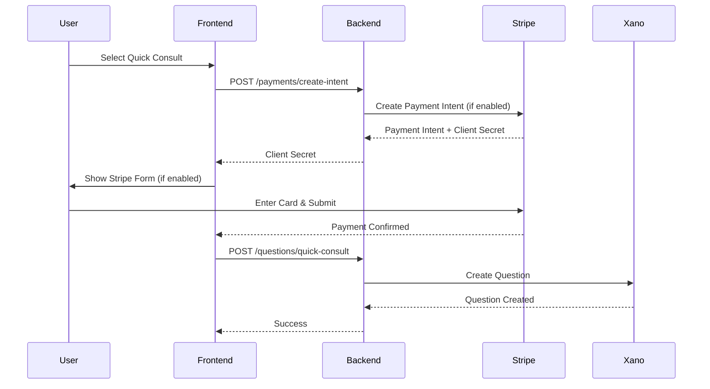

# Stripe Payment Integration

**Status:** ✅ Implemented with Feature Flag
**Date:** October 23, 2025
**Version:** 1.0

---

## Overview

QuickChat integrates with Stripe for payment processing in the two-tier pricing system. The integration is **fully modular** with a feature flag that allows you to enable/disable Stripe for testing purposes.

### Key Features

- ✅ **Feature Flag**: Turn Stripe on/off with a single environment variable
- ✅ **Mock Mode**: When disabled, automatically generates mock payment intents for testing
- ✅ **Stripe Elements**: Secure card input UI when enabled
- ✅ **Payment Intents API**: Supports both immediate capture (Quick Consult) and hold/capture (Deep Dive)
- ✅ **Error Handling**: Graceful fallbacks and clear error messages

---

## Feature Flag Usage

### Enable Stripe (Production)

```bash
# Backend (.env or Vercel Environment Variables)
STRIPE_ENABLED=true
STRIPE_SECRET_KEY=sk_live_your_live_secret_key
STRIPE_PUBLIC_KEY=pk_live_your_live_public_key

# Frontend (.env.local)
VITE_STRIPE_ENABLED=true
VITE_STRIPE_PUBLIC_KEY=pk_live_your_live_public_key
```

### Disable Stripe (Testing/Development)

```bash
# Backend
STRIPE_ENABLED=false

# Frontend
VITE_STRIPE_ENABLED=false
```

**When disabled:**
- Backend creates mock payment intents with ID `pi_mock_...`
- Frontend shows "Testing Mode" banner
- No actual Stripe API calls are made
- Questions are created without payment processing

---

## Architecture

### Backend Components

#### 1. Stripe Service (`/api/lib/stripe.js`)

Central service for all Stripe operations with mock mode support.

**Functions:**
- `createPaymentIntent({ amount, currency, description, metadata })` - Create payment intent (real or mock)
- `retrievePaymentIntent(paymentIntentId)` - Get payment intent details
- `confirmPaymentIntent(paymentIntentId)` - Confirm payment
- `capturePaymentIntent(paymentIntentId, amountToCapture)` - Capture authorized payment (for Deep Dive)
- `cancelPaymentIntent(paymentIntentId)` - Cancel payment (for declined Deep Dive offers)
- `isEnabled()` - Check if Stripe is enabled
- `getConfig()` - Get Stripe configuration

**Mock Mode Behavior:**
```javascript
// When STRIPE_ENABLED=false
const intent = await createPaymentIntent({ amount: 5000 });
// Returns: {
//   id: 'pi_mock_1729800000_abc123',
//   status: 'succeeded',
//   isMock: true
// }
```

#### 2. Payment Intent Endpoint (`/api/payments/create-intent.js`)

Creates Stripe payment intent for question submission.

**Request:**
```json
POST /api/payments/create-intent
{
  "amount": 5000,          // Amount in cents ($50.00)
  "currency": "usd",       // Currency code
  "description": "Quick Consult: How to optimize my website?",
  "metadata": {
    "expert_handle": "john-doe",
    "tier_type": "quick_consult",
    "question_title": "How to optimize my website?"
  }
}
```

**Response:**
```json
{
  "success": true,
  "clientSecret": "pi_abc123_secret_xyz789",
  "paymentIntentId": "pi_abc123",
  "amount": 5000,
  "currency": "usd",
  "isMock": false
}
```

**Response (Mock Mode):**
```json
{
  "success": true,
  "clientSecret": "pi_mock_secret_1729800000",
  "paymentIntentId": "pi_mock_1729800000_abc123",
  "amount": 5000,
  "currency": "usd",
  "isMock": true
}
```

### Frontend Components

#### 1. Payment Hook (`/src/hooks/usePayment.js`)

React hook for payment operations with feature flag detection.

**Usage:**
```javascript
import { usePayment } from '@/hooks/usePayment';

function PaymentComponent() {
  const {
    createPaymentIntent,
    stripeEnabled,
    config
  } = usePayment();

  const handleCreatePayment = async () => {
    const intent = await createPaymentIntent({
      amount: 5000,
      description: 'Quick Consult'
    });

    if (intent.isMock) {
      console.log('Mock payment created');
    }
  };
}
```

**Returns:**
- `isLoading` (boolean) - Loading state
- `error` (string | null) - Error message
- `paymentIntent` (object | null) - Current payment intent
- `stripeEnabled` (boolean) - Whether Stripe is enabled
- `stripePublicKey` (string | null) - Stripe public key
- `createPaymentIntent(params)` - Create payment intent
- `processPayment(paymentIntentId)` - Process payment
- `reset()` - Reset state
- `config` (object) - Stripe configuration

#### 2. Stripe Payment Form (`/src/components/question-flow-v2/payment/StripePaymentForm.jsx`)

Stripe Elements card input form (only shown when Stripe is enabled).

**Features:**
- Secure card input using Stripe CardElement
- Real-time validation
- Loading states
- Error handling
- Payment confirmation

#### 3. Payment Placeholder (`/src/components/question-flow-v2/payment/PaymentPlaceholder.jsx`)

Main payment component that renders different UI based on Stripe mode:
- **Stripe Enabled**: Shows Stripe payment form with card input
- **Stripe Disabled**: Shows "Testing Mode" banner with direct submit button

**Props:**
```javascript
<PaymentPlaceholder
  expert={expertData}
  tierType="quick_consult" // or "deep_dive"
  tierConfig={tierConfig}
  composeData={questionData}
  reviewData={askerData}
  onSubmit={(paymentIntentId) => handleSubmit(paymentIntentId)}
  isSubmitting={false}
/>
```

---

## Payment Flows

### Quick Consult (Tier 1)

Fixed price, immediate capture:

1. User selects Quick Consult tier
2. Frontend creates payment intent with fixed price
3. **If Stripe enabled**: User enters card details → Stripe processes payment
4. **If Stripe disabled**: Mock payment intent created instantly
5. Question submitted with `stripe_payment_intent_id`
6. Question created with `status = 'paid'`



### Deep Dive (Tier 2)

Custom price, hold payment until expert accepts:

1. User selects Deep Dive tier and proposes price
2. Frontend creates payment intent with proposed price
3. **If Stripe enabled**: User authorizes payment (hold, not capture)
4. **If Stripe disabled**: Mock payment intent created instantly
5. Question submitted with `pricing_status = 'offer_pending'`
6. Expert reviews offer:
   - **If accepted**: Backend captures payment via `capturePaymentIntent()`
   - **If declined**: Backend cancels payment via `cancelPaymentIntent()`

**Note:** For Deep Dive, payment authorization needs to be implemented with `capture_method: 'manual'` in the payment intent creation.

---

## Stripe Account Setup

Before using Stripe, you need to configure your Stripe account. See **[STRIPE-SETUP-GUIDE.md](./STRIPE-SETUP-GUIDE.md)** for complete setup instructions including:

- Creating a Stripe account
- Getting API keys (test and live)
- Completing business verification
- Configuring payment methods
- Setting up fraud prevention
- Going live with production

**Quick Start for Testing:**
1. Sign up at https://stripe.com
2. Get test API keys from Dashboard → Developers → API keys
3. Copy to `.env.local` (see below)

## Testing

### Test Stripe Integration (Mock Mode OFF)

1. **Get Stripe Test Keys:**
   - Go to https://dashboard.stripe.com/test/apikeys
   - Copy test secret key (starts with `sk_test_...`)
   - Copy test public key (starts with `pk_test_...`)

2. **Set Environment Variables:**
   ```bash
   # Backend
   STRIPE_ENABLED=true
   STRIPE_SECRET_KEY=sk_test_your_test_key
   STRIPE_PUBLIC_KEY=pk_test_your_test_key

   # Frontend
   VITE_STRIPE_ENABLED=true
   VITE_STRIPE_PUBLIC_KEY=pk_test_your_test_key
   ```

3. **Use Test Cards:**
   - **Success**: `4242 4242 4242 4242`
   - **Decline**: `4000 0000 0000 0002`
   - **3D Secure**: `4000 0025 0000 3155`
   - Any future expiry date, any CVC, any ZIP

4. **Test Flow:**
   - Submit a Quick Consult question
   - Enter test card details
   - Payment should process
   - Question should be created

### Test Mock Mode (Mock Mode ON)

1. **Set Environment Variables:**
   ```bash
   # Backend
   STRIPE_ENABLED=false

   # Frontend
   VITE_STRIPE_ENABLED=false
   ```

2. **Restart Services:**
   ```bash
   npm run dev        # Restart frontend
   npm run vercel:dev # Restart backend (if testing locally)
   ```

3. **Test Flow:**
   - Submit a Quick Consult question
   - Should see "Testing Mode" banner
   - Click "Submit Question (Test Mode)"
   - Question should be created with mock payment ID

4. **Verify Mock Payment ID:**
   - Check database: `stripe_payment_intent_id` should start with `pi_mock_`

---

## Installation

### 1. Install Dependencies

```bash
npm install stripe @stripe/stripe-js @stripe/react-stripe-js
```

Already added to `package.json`:
```json
{
  "dependencies": {
    "stripe": "^17.6.0",
    "@stripe/stripe-js": "^4.10.0",
    "@stripe/react-stripe-js": "^2.10.0"
  }
}
```

### 2. Configure Environment Variables

Copy `.env.example` to `.env.local` and fill in values:

```bash
cp .env.example .env.local
```

**For development (mock mode):**
```bash
STRIPE_ENABLED=false
VITE_STRIPE_ENABLED=false
```

**For staging/production:**
```bash
STRIPE_ENABLED=true
STRIPE_SECRET_KEY=sk_test_or_live_key
STRIPE_PUBLIC_KEY=pk_test_or_live_key
VITE_STRIPE_ENABLED=true
VITE_STRIPE_PUBLIC_KEY=pk_test_or_live_key
```

### 3. Deploy to Vercel

Add environment variables to Vercel project:

1. Go to Vercel project → Settings → Environment Variables
2. Add:
   - `STRIPE_ENABLED` = `true` or `false`
   - `STRIPE_SECRET_KEY` = Your secret key
   - `STRIPE_PUBLIC_KEY` = Your public key
   - `VITE_STRIPE_ENABLED` = `true` or `false`
   - `VITE_STRIPE_PUBLIC_KEY` = Your public key

3. Redeploy:
   ```bash
   npm run vercel:deploy
   ```

---

## API Reference

### Backend API

#### Create Payment Intent

```http
POST /api/payments/create-intent
Content-Type: application/json

{
  "amount": 5000,
  "currency": "usd",
  "description": "Question payment",
  "metadata": {}
}
```

**Response:**
```json
{
  "success": true,
  "clientSecret": "pi_xxx_secret_yyy",
  "paymentIntentId": "pi_xxx",
  "amount": 5000,
  "currency": "usd",
  "isMock": false
}
```

#### Submit Question (Quick Consult)

```http
POST /api/questions/quick-consult
Content-Type: application/json

{
  "expertHandle": "john-doe",
  "title": "Question title",
  "text": "Question text",
  "payerEmail": "asker@example.com",
  "sla_hours_snapshot": 24,
  "stripe_payment_intent_id": "pi_xxx"
}
```

#### Submit Question (Deep Dive)

```http
POST /api/questions/deep-dive
Content-Type: application/json

{
  "expertHandle": "john-doe",
  "title": "Question title",
  "text": "Question text",
  "payerEmail": "asker@example.com",
  "proposed_price_cents": 7000,
  "asker_message": "Please review...",
  "sla_hours_snapshot": 48,
  "stripe_payment_intent_id": "pi_xxx"
}
```

---

## Security Considerations

### 1. API Key Protection

- ✅ Never commit API keys to git
- ✅ Use environment variables
- ✅ Use test keys in development
- ✅ Use live keys only in production

### 2. Client-Side Security

- ✅ Stripe Elements handles card data (never touches your server)
- ✅ PCI compliance handled by Stripe
- ✅ Client Secret is single-use and short-lived

### 3. Server-Side Validation

- ✅ Always validate payment status before creating question
- ✅ Check payment amount matches expected amount
- ✅ Verify payment intent is not already used

### 4. Mock Mode Security

- ⚠️ **IMPORTANT**: Mock mode should ONLY be enabled in development
- ⚠️ In production, always set `STRIPE_ENABLED=true`
- ⚠️ Mock payment IDs are easily identifiable (`pi_mock_...`)

---

## Troubleshooting

### Issue: "Stripe is not properly configured"

**Cause**: Stripe is enabled but `STRIPE_SECRET_KEY` is not set

**Solution**:
```bash
# Add to .env.local or Vercel environment variables
STRIPE_SECRET_KEY=sk_test_your_key_here
```

### Issue: "Cannot read properties of undefined (reading 'confirmCardPayment')"

**Cause**: Stripe.js not loaded or public key missing

**Solution**:
```bash
# Add to .env.local
VITE_STRIPE_PUBLIC_KEY=pk_test_your_key_here
```

### Issue: Mock mode not working

**Cause**: Feature flag not properly set

**Solution**:
```bash
# Backend (.env)
STRIPE_ENABLED=false

# Frontend (.env.local)
VITE_STRIPE_ENABLED=false

# Restart both frontend and backend
npm run dev
npm run vercel:dev
```

### Issue: Payment succeeds but question not created

**Cause**: Missing `stripe_payment_intent_id` in question submission

**Solution**: Check that `onSubmit` callback receives payment intent ID:
```javascript
<PaymentPlaceholder
  onSubmit={(paymentIntentId) => {
    console.log('Payment ID:', paymentIntentId);
    // Pass to question submission
  }}
/>
```

---

## Future Enhancements

1. **Deep Dive Hold/Capture**: Implement `capture_method: 'manual'` for Deep Dive offers
2. **Refunds**: Add refund API for declined Deep Dive offers (currently uses cancel)
3. **Webhooks**: Add Stripe webhook handling for async payment events
4. **Payment Methods**: Support alternative payment methods (Apple Pay, Google Pay)
5. **Subscription**: Add subscription support for recurring questions
6. **Analytics**: Track payment metrics and conversion rates

---

## Related Documentation

- **Two-Tier Pricing System**: `/docs/two-tier question model/README.md`
- **API Implementation**: `/docs/two-tier question model/API-IMPLEMENTATION-COMPLETE.md`
- **Frontend Implementation**: `/docs/two-tier question model/FRONTEND-IMPLEMENTATION-COMPLETE.md`
- **Deployment Checklist**: `/docs/two-tier question model/FINAL-DEPLOYMENT-CHECKLIST.md`

---

**Last Updated:** October 23, 2025
**Version:** 1.0
